# Auth backend service

This authentication backend service can be used to signup, signin, or signout a given user using a users email, and password. This system uses Mongodb as a backend database service to persist the users data. It equipped with kubernetes deployment files so just add this project to your existing kuberneted infra folder and run few command and this would be good to go.

## Description

This is express server written in node.js. It has following routes

### 1. [POST]api/users/signup

<p align="start">
  
</p>

### 2. [POST]api/users/signin

<p align="startstart">
  
</p>

### 3. [POST]api/users/signout

<p align="start">
  
</p>

### 4. [GET]api/users/currentuser

<p align="start">
  
</p>

## Getting Started

### Dependencies

- To run this to your local kubernetes cluster, install following tools to your local machine,

  - **DOCKER DESKTOP**: Install <a href="https://www.docker.com/products/docker-desktop/">Docker desktop</a> (this will be used to make docker images, and use its local kubernetes cluster for hosting the system), and make sure to enable kubernetes service once you successfully installed it.
  - **KUBECTL** (Kubernetes command line tool comes with docker destop): open your terminal (command line tool) and run following command to check whether you have it on your machine,

    ```bash
    kubectl version
    ```

    If you see a result similar with the follows, it means you have kubectl installed on your machine

    ```bash
    Client Version: v1.29.2
    Kustomize Version: v5.0.4-0.20230601165947-6ce0bf390ce3
    Server Version: v1.29.2
    ```

    If not then install kubectl from <a href="https://kubernetes.io/docs/tasks/tools/">here</a>

  - **KUBERNETES CLUSTER**: Now we have to check whether we have the right kubernetes cluster context set as default, Cluster context will act as a bridge between your local machine and your kubernetes cluster. As we are planning to use the kubernetes cluster which comes with docker desktop, Enable kubernetes in the setting section of docket desktop, and run following command in your command line tool

    ```bash
    kubectl config get-contexts
    ```

    This should show you the list of all available context as follows, currently we have only one which is actully a defalut cluster which comes with docker desktop tool installed locally, in your case this list might show you multiple clusters if you have worked with clusters in past,
    <p align="start">
      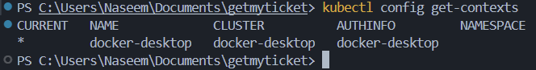
    </p>
    Please select docket-desktop cluster by running following command, this command will set your current cluster as docker-desktop

    ```bash
    kubectl config set-context docker-desktop
    ```

    You should see following result upon runnig this command
    <p align="start">
      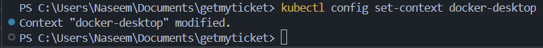
    </p>
    Which means that you have right kubernetes cluster selected,

  - **SKAFFOLD**: Skaffold is a CD tool that will do a lot of side task for you when it comes to the large scale project development using docker, kubernetes etc. Install this tool according to your operating system from <a href="https://skaffold.dev/docs/install/">here</a>.

  - **DOCKER HUB CUSTOM REPO**: Bacause this project is using a docker hub repository, so you have to create a custom repository for this project, mine is naseemahmad244/auth, but you have to create your own repository by following the steps mentioned here

    - <a href="https://hub.docker.com/">Login</a> to docker hub
    - Go to repository section, and click create repository
      <p aling="start">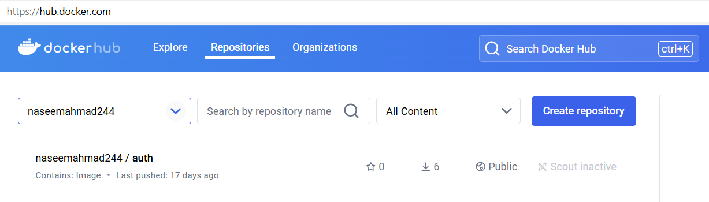</p>
    - Type a name of this repo, and click create
      <p aling="start">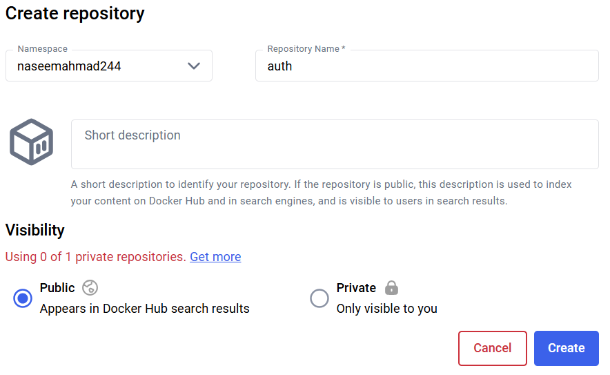</p>
    - Copy this name as we need to use this name in some of our files in this github repository

  - **GIT**: Git is a command line tool that we need to work with this github repository, Check if you aleady have git installed, Run following command in your command line tool

    ```bash
    git --version
    ```

    If your response is not similar to the following then you have to install git from <a href="https://git-scm.com/downloads">here</a> according to your operating system.
      <p aling="start">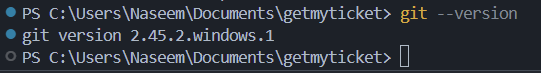</p>

    ✨CONGRATULATIONS! You have the neccessory infrastructure ready.. 💪 👏

### Downloading/Cloning the repo and making necessory changes

- The very first step is to clone/download this github repository to your local system, Go to next step once you have all the folders/files in your system
- Open the folder (which contains all folders and files from this repo) in vs code or any other IDE, in my case all the folders are in GETMYTICKET folder as follows
  <p>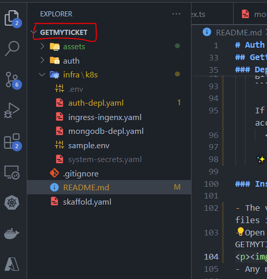</p>
- Open system-secret.yaml file and insert string value against JWT_SECRET field
  <p>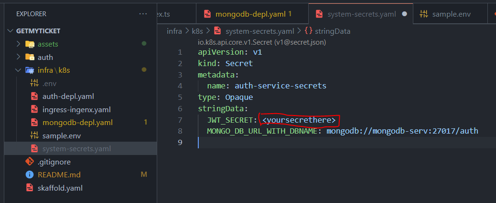</p>
- Open auth-depl.yaml file and update the name of the dockerhub repository that you have created in one of earlier step
  <p>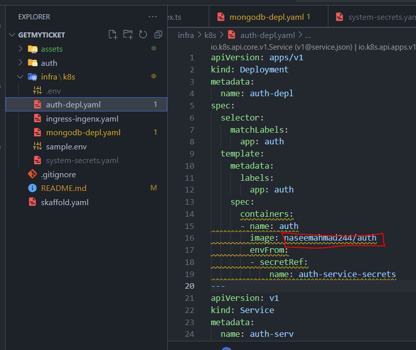</p>
- Do the same for skaffold.yaml file
  <p>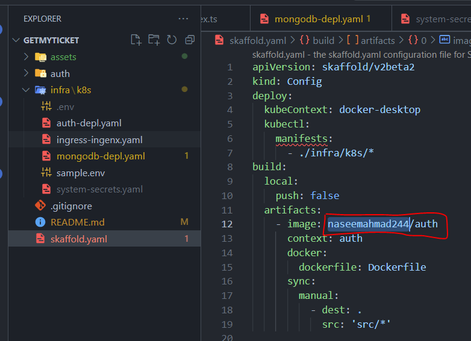</p>
- The ingress-controller (load balancer) is using getmyticket.dev as the host as follows
  <p>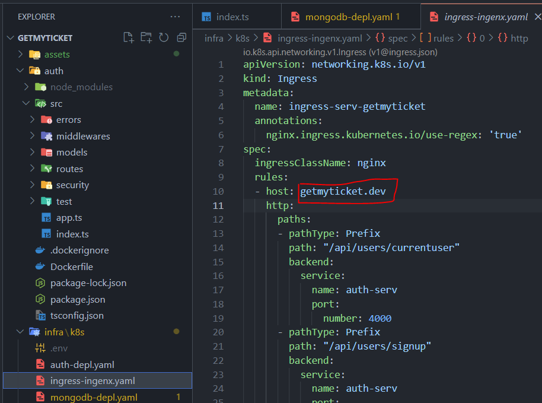</p>
  So we have to change our local machine host file, open host file as per your OS, for windows, open c:\Windows\System32\Drivers\etc\hosts and add below highlighted string
  <p>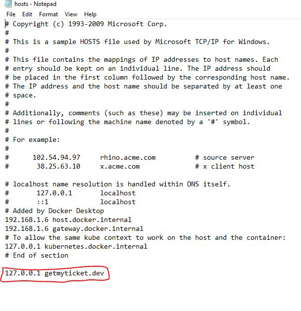</p>

✨CONGRATULATIONS! You have all the codebase ready to conquer.. 💪 👏

### Executing program

-Start Docker desktop, and Start terminal (Go to Terminal>New Terminal in vscode), and make sure that terminal should open the root folder as shown below, and run following command

```bash
  skaffold dev
```

- Skaffold sometime raise errors on first startup, you see some errors then dont worry, press ctrl+C in terminal pane and rerun the above command
- You should see results similar to the following, if yes then you are ready to use this system
  <p>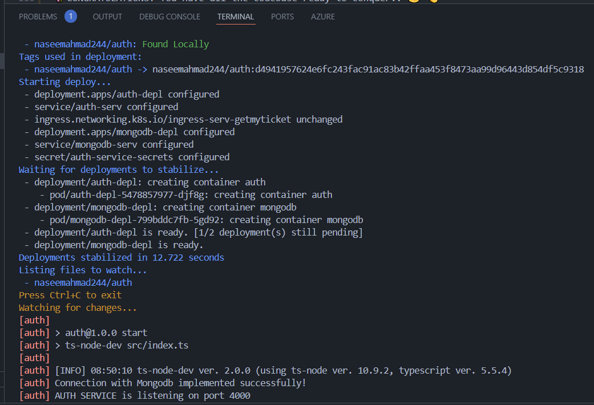</p>

## Hitting the API and getting result

You can use postman to hit these api and get responses, Open postman, click File > import, pick AuthServices.postman_collection.json from postman folder of this repository, you have all the routes with some test request body, go ahead and play with the postman requests.

<p>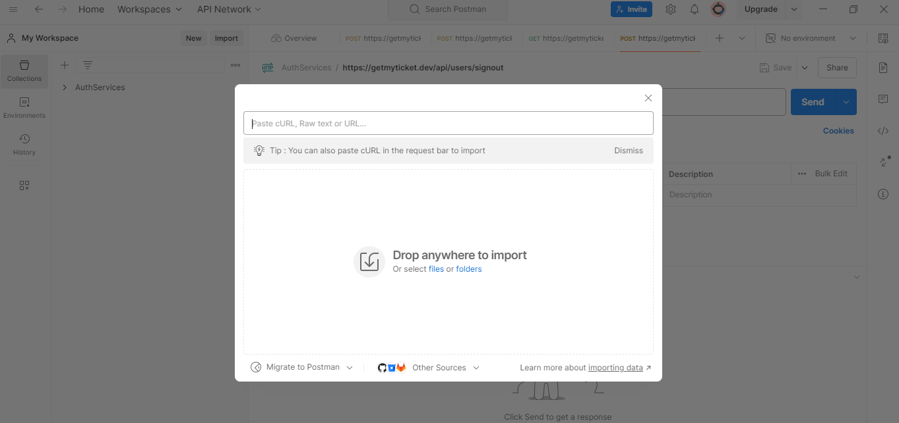</p>

```markdown
## Help

Raise issues in this repo if something breaks up.
```

```markdown
## Version History

- 1.0.0
  - Initial Release
```

```markdown
## License

This project is licensed under the MIT License - see the LICENSE.md file for details
```

## Authors

**Naseem Ahmad**

<p><a href="https://www.linkedin.com/in/thenaseemahmad/">https://www.linkedin.com/in/thenaseemahmad/</a></p>
