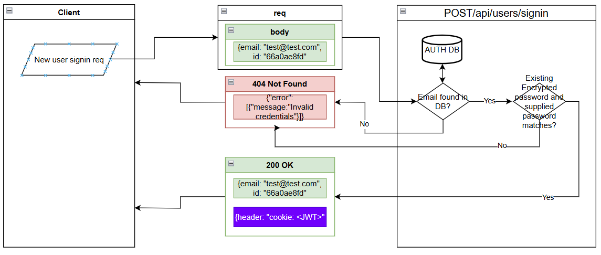

# Auth backend service

This authentication backend service can be used to signup, signin, or signout a given user using a users email, and password. This system uses Mongodb as a backend database service to persist the users data. It equipped with kubernetes deployment files so just add this project to your existing kuberneted infra folder and run few command and this would be good to go.

## Description

This is express server written in node.js. It has following routes

### 1. [POST]api/users/signup

<p align="center">
  
</p>

### 2. [POST]api/users/signin

<p align="center">
  
</p>

### 3. [POST]api/users/signout

<p align="center">
  
</p>

### 4. [GET]api/users/currentuser

<p align="center">
  
</p>

## Getting Started

### Dependencies

- This project is equipped with all necessory kubernetes deployment yaml files in infra/k8s folder, so you should have a kubernetes cluster context. There are following ways to get a cluster context,
  - A cloud based kubernetes cluster:
  - A local kubernetes cluster such as docker-desktop that comes as a default cluster with docker desktop for windows, MAC, or Linux:
- ex. Windows 10

### Installing

- How/where to download your program
- Any modifications needed to be made to files/folders

### Executing program

- How to run the program
- Step-by-step bullets

```markdown
## Help

Any advise for common problems or issues.
```

```markdown
## Authors

Contributors names and contact info

ex. Ahmad Naseem
ex. [ _An external link was removed to protect your privacy._ /)
```

```markdown
## Version History

- 0.2
  - Various bug fixes and optimizations
  - See [commit change]() or See [release history]()
- 0.1
  - Initial Release
```

```markdown
## License

This project is licensed under the [LICENSE NAME] License - see the LICENSE.md file for details
```

```markdown
## Acknowledgments

Inspiration, code snippets, etc.

- [ _An external link was removed to protect your privacy._ )
- [ _An external link was removed to protect your privacy._ )
- [ _An external link was removed to protect your privacy._ /)
- [ _An external link was removed to protect your privacy._ /)
- [ _An external link was removed to protect your privacy._ /)
```
